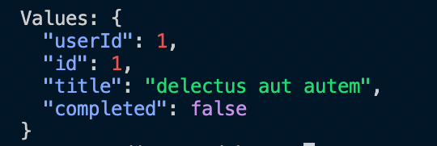

[](https://github.com/Naereen/StrapDown.js/blob/master/LICENSE)
[](https://github.com/OmarAouini/colorcurl/actions/workflows/rust.yml)
<br>

# ColorCurl

colorcurl (ccurl) is a CLI utlity that pretty print colored http calls and rest api pulls.

## Installation

Just download the executable for your platform and run it from the console.
Example rest api call:<br>
cd into the same folder of the executable:
```bash
./ccurl -r https://jsonplaceholder.typicode.com/todos/1
./ccurl -rw https://jsonplaceholder.typicode.com/todos/1 /path/to/file/location/

```
Example response:



## Usage:
Parameters:

```bash
-r : REST api call
-rw: Write the REST result to a file, given a path
-h : print help-message

```

## Contributing
Pull requests are welcome. For major changes, please open an issue first to discuss what you would like to change.

## License
[MIT](https://choosealicense.com/licenses/mit/)
